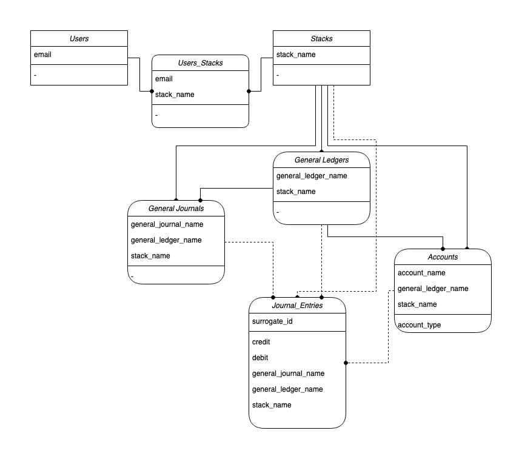

1. Prerequisites:
   1. Schema
   1. User table (identity management is not part of `derp-books-db`)
   1. Create user
1. MVP, Chart of Accounts:
   1. Create stacks associated with a user
   1. Create ledgers in a stack
   1. Create accounts in a ledger
   1. View chart of accounts

Ideas:

1. A ledger 'template' would allow enforcing currency between ledgers, linking ledger accounts

pagination supports size, before, after parameters

- page
  - size
  - before
  - after
- sort
